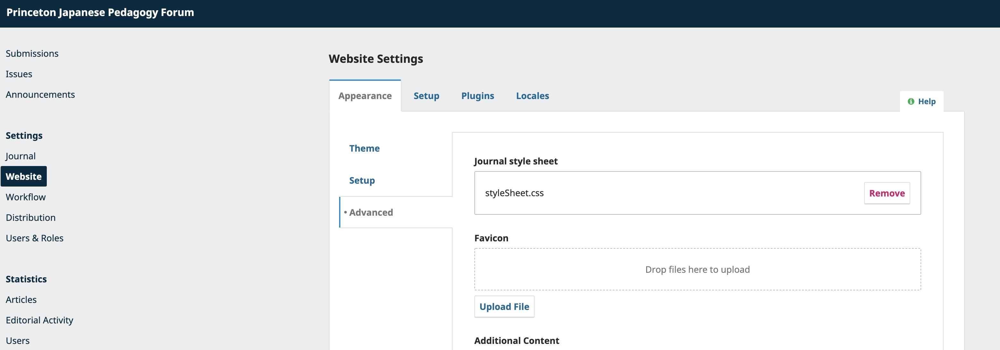

# README for `ojs_styles`

This repository contains custom stylesheets developed for PUL OJS custom styles.

## Contents

* [noto_sans_jp.css](noto_sans_jp.css)
  * Custom stylesheet supporting the [Noto Sans Japanese](https://fonts.google.com/noto/specimen/Noto+Sans+JP) font from Google Fonts, used in conjunction with the OJS healthSciences theme.
  * [OpenPublishing originating issue](https://github.com/pulibrary/openpublishing/issues/43), for context.

## How to use

* Save a copy of your custom CSS file locally.
* Log into your OJS installation and navigate to the Dashboard.
* On the left sidebar menu under "Settings," select "Website."
* Under the "Appearance" tab, select "Advanced."
* Under "Journal style sheet," click the "Upload File" button.
* Upload your locally-saved CSS file, then click "Save" in the bottom right corner of the page.  
* Refresh the frontend view of your OJS site.  Your changes should now be visible.

### Screenshot of the admin interface:

